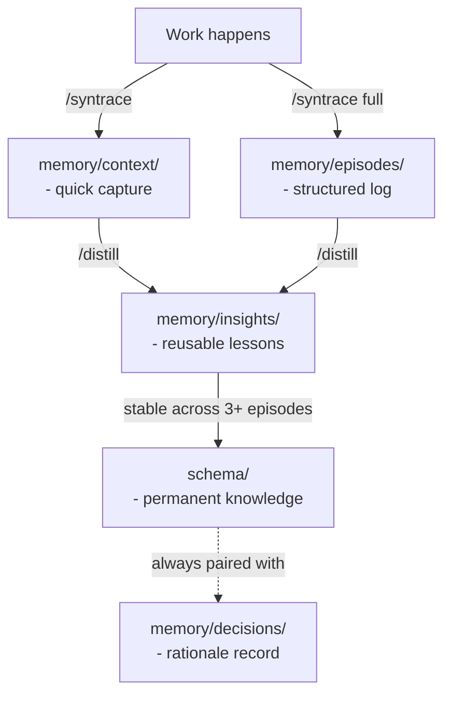

<p align="center">
  
</p>

<h1 align="center">Syntrace</h1>

<p align="center">
  <strong>Give your AI agents a memory that survives platform switches.<br/>Just folders and markdown. Works everywhere.</strong>
</p>

<p align="center">
  <a href="https://github.com/leksval/syntrace"></a>&nbsp;
  <a href="#license"></a>&nbsp;
  &nbsp;
  
</p>

<p align="center">
  <a href="#why">Why</a> · <a href="#how-it-works">How It Works</a> · <a href="#get-started">Get Started</a> · <a href="#architecture">Architecture</a> · <a href="#agent-reference">Agent Reference</a>
</p>

---

## Why

Every time you switch AI tools - Cursor, Claude Code, Windsurf, your own agents - your context resets. Architecture decisions, patterns, lessons learned: all gone.

Syntrace fixes this. It stores project knowledge as plain files that any AI can read and write. **Switch tools, keep the memory.**

> No database. No API keys. No vendor lock-in. Copy a folder into your project and go.

---

## How It Works

Syntrace splits knowledge into two layers:

<table>
<tr>
<td width="50%" valign="top">

### Schema - the slow layer

What your project **is**. Changes rarely.

- Agent roles and responsibilities
- Architectural patterns and playbooks
- Quality policies and standards
- Tool definitions and contracts
- Graph schema for knowledge queries

</td>
<td width="50%" valign="top">

### Memory - the fast layer

What your project **learned**. Changes every session.

- Design decisions and their rationale
- Work logs and experiment results
- Distilled insights and reusable knowledge
- Quick captures and session notes

</td>
</tr>
</table>

Agents read both layers before they act. They write back when they're done. The knowledge stays with the project, not the platform.

---

## Get Started

**1. Copy into your project**

```bash
cp -r syntrace/ your-project/
```

**2. Tell your AI about it** (pick your platform)

- **Cursor** -- `cp syntrace/cursor-rule.mdc .cursor/rules/syntrace.mdc`
- **Claude Code** -- point it at `README.md`
- **Windsurf** -- add `README.md` as workspace context
- **Custom agents** -- have them read this file before acting, write to `memory/` after

Three commands become available:

| Command | What happens |
|---------|-------------|
| `/syntrace` | Quick save - captures key points to `memory/context/` |
| `/syntrace full` | Full save - structured episode, decision record, changelog |
| `/distill` | Extract patterns - turns raw notes into reusable insights |

---

## What's Inside

```
syntrace/
├── README.md               Single source of truth (this file)
├── CHANGELOG.md             Project history, auto-appended
└── memory/
    ├── context/             Quick captures (default landing zone)
    ├── decisions/           Why you chose X over Y (ADR-style)
    ├── episodes/            What happened (work logs, experiments)
    └── insights/            Reusable lessons extracted from episodes
```

Templates are inline in the Frontmatter Schemas section below. Schema is guarded (changes need a decision record). Memory is open (agents write freely).

---

## Knowledge Flow



---

## Architecture

<table>
<tr>
<td width="50%" valign="top">

### Agent roles

| Role | Does | Invariants |
|------|------|------------|
| **Planner** | Decomposes goals, delegates, synthesizes | No irreversible actions without human OK. Log all decisions with rationale. |
| **Worker** | Executes one subtask using tools | Never exceed assigned scope. On failure: return error + context, no silent retry. |
| **Critic** | Reviews output; PASS / REVISE / REJECT | Never approve invariant violations. Critique must be specific. |
| **Librarian** | Distills notes into insights, proposes schema promotions | Never modify schema/ directly. Tag insights with date, source, confidence. |

New roles are added as specialized workers, not new top-level roles.

</td>
<td width="50%" valign="top">

### Design principles

- **Zero dependencies** -- no database, no embeddings, no API keys.
- **Platform-portable** -- Cursor, Claude Code, Windsurf, custom agents, mobile.
- **Git-native** -- diff decisions, branch experiments, merge insights.
- **Cloud-connected** -- link Figma, Notion, Drive from frontmatter.
- **Convention-enforced** -- trusts agents to follow specs.

</td>
</tr>
</table>

### Planner-Worker-Critic cycle

```
[User/Goal] → [Planner] → subtask → [Worker] → result → [Critic]
                  ↑                                         |
                  +──── revised task ──── REVISE ───────────+
                                            |
                                          PASS → [Planner] → [Output]
```

- `max_revisions`: 2 (default). Critic too strict = infinite loops. Too lenient = garbage passes.
- Use for any task requiring QA. Skip for simple, single-step, low-stakes tasks.

### Distillation (`/distill`)

1. Scan `memory/context/` and recent `memory/episodes/` for patterns
2. Create or update `memory/insights/` (increment `episode_count` on existing)
3. Flag insights with `episode_count >= 3` for schema promotion (human review)
4. Log the run as `memory/episodes/YYYY-MM-DD-distillation.md`
5. Delete or archive processed context items

### Quality standards

Critic uses these checks on every review:

- [ ] Output matches expected format
- [ ] No invariants from agent specs are violated
- [ ] No hallucinated tool outputs (verify actual tool was called)
- [ ] Rationale is present for non-obvious decisions

Verdicts: **PASS** (all checks pass) · **REVISE** (minor issues, specific critique) · **REJECT** (critical failure)

### Architectural reflection

Checklist for the reflect step of `/syntrace` and `/syntrace full`:

- [ ] Did a structural pattern prove useful or fragile?
- [ ] Is there a spec-vs-implementation gap?
- [ ] Did a missing file or config cause silent degradation?
- [ ] Is there unnecessary complexity?
- [ ] What from this project would you copy into a new project tomorrow?

### Graph queries

Agents query relationships between files using standard file tools (glob, read, grep). No database.

| Step | Action |
|------|--------|
| 1 | Glob `memory/` subfolders to discover nodes (each `.md` file = a node) |
| 2 | Parse frontmatter to identify node type from the folder it lives in |
| 3 | Parse frontmatter to extract edges (`related`, `source`, `replaces`, `tags`) |
| 4 | Scan `## Related` sections for markdown link edges |
| 5 | Assemble and query the graph |

**Scaling** (when `memory/` grows beyond ~30 files):

| Strategy | When | Method |
|----------|------|--------|
| Tag-first | 30-100 files | Grep `tags:` lines, read only matching files |
| Recency + confidence | 100+ files | 20 most recent + all `confidence: high` |
| Graph-guided | Relationship queries | Walk `related`/`source` edges 1-2 hops from a known node |
| Full build | `/distill` and audits only | Never as prerequisite to routine work |

### Tool registry

Define project tools using this format (create a `tools.md` or add inline):

```markdown
### <tool-name>
- **Description**: What it does
- **Input**: schema / types
- **Output**: schema / types
- **Side effects**: (e.g., external API call)
- **Failure modes**: known failures and handling
- **Assigned to**: which agents may use this tool
```

---

## Agent Reference

> If you are an AI agent, this is your canonical reference. Read this section before acting.

### Before You Act

1. Read the Architecture section above for agent roles, patterns, and policies.
2. Check `memory/insights/` for prior knowledge on the topic.
3. Read the Architecture section above for patterns and policies.
4. For deeper retrieval, see the Graph queries section above.

### Save Protocol

Three tiers. Use the lightest one that fits.

| Tier | Trigger | Create | Then |
|------|---------|--------|------|
| Quick | `/syntrace` | `memory/context/YYYY-MM-DD-slug.md` | Reflect: did a reusable pattern emerge? If yes, also create an insight. |
| Full | `/syntrace full` | `memory/episodes/YYYY-MM-DD-slug.md` + `memory/decisions/YYYY-MM-DD-HHMM-slug.md` if a design choice was made | Append `changelog:` to `CHANGELOG.md`. Reflect: update or create insights. |
| Distill | `/distill` | Insights from context + episodes | Flag `episode_count >= 3` for schema promotion. |

After every save, run through the architectural reflection checklist above.

When done for the session: **commit code**, then **save memory**.

### Frontmatter Schemas

Fields marked `# auto` are filled by the agent. Fields marked `# optional` can be omitted.

**Context** (`memory/context/YYYY-MM-DD-slug.md`)
```yaml
---
date:                    # auto
tags: []
context_read: []         # auto
links: []                # optional
---
```
Body: a few sentences or bullet points. No structure required.

**Episode** (`memory/episodes/YYYY-MM-DD-slug.md`)
```yaml
---
date:                    # auto
outcome: SUCCESS | FAIL | SURPRISE | PARTIAL
tags: []
context_read: []         # auto
changelog:               # optional — type: description
links: []                # optional
related: []
---
```
Sections: `## What happened` · `## Takeaways` · `## Observations` (optional).
Experiments add: `type: experiment`, `status: planned | running | done | abandoned`.
Retrospectives add: `type: retrospective`, `subtype: weekly | milestone | post-mortem`.

**Decision** (`memory/decisions/YYYY-MM-DD-HHMM-slug.md`)
```yaml
---
id:                      # auto — YYYY-MM-DD-HHMM-slug
status: accepted
tags: []
context_read: []         # auto
changelog:               # optional
replaces:                # optional — path to old decision
links: []                # optional
related: []
---
```
Sections: `## Context` · `## Decision` · `## Alternatives considered` · `## Consequences`.

**Insight** (`memory/insights/YYYY-MM-DD-slug.md`)
```yaml
---
id:                      # auto — YYYY-MM-DD-slug
type: concept | howto
confidence: low | medium | high
episode_count: 1
tags: []
context_read: []         # auto
links: []                # optional
related: []
---
```
Sections: `## Summary` · `## Detail` · `## When to apply` · `## History`.

### Auto-derived fields

Fill automatically -- never prompt:

| Field | Value |
|-------|-------|
| `date` / `created` / `updated` | Today's date |
| `agent` | Current agent or `"human"` |
| `project` | Workspace/project name |
| `source` | `"session"` unless more specific |
| `context_read` | Files consulted before writing |

When notable, add `changelog: "type: description"` and auto-append `[YYYY-MM-DD] <value>` to `CHANGELOG.md`.

---

## Conventions

- Filenames: `YYYY-MM-DD-slug.md`, lowercase, hyphens, no spaces.
- Max ~300 lines per `.md` file; split if longer.
- Relative markdown links between files.
- `tags: [...]` in YAML frontmatter for searchability.
- Any file can include `links: []` for external URLs.
- Never commit secrets; use `.env` (gitignored).
- Never modify `schema/` without a decision record.

---

## Contributing

1. Fork the repo
2. Create a branch: `git checkout -b my-feature`
3. Commit your changes: `git commit -m "add: my feature"`
4. Open a Pull Request

For structural changes to `schema/`, include a decision record in `memory/decisions/`.

---

<p align="center">
  If Syntrace is useful, star the repo. It helps others find it.<br/><br/>
  <a href="https://github.com/leksval/syntrace"></a>
</p>

---

<p align="center">
  <a href="https://creativecommons.org/licenses/by/4.0/">
    
  </a>
</p>

<p align="center">
  This work is licensed under <a href="https://creativecommons.org/licenses/by/4.0/">Creative Commons Attribution 4.0 International</a>.<br/>
  Use it, remix it, share it. Just give credit.
</p>
