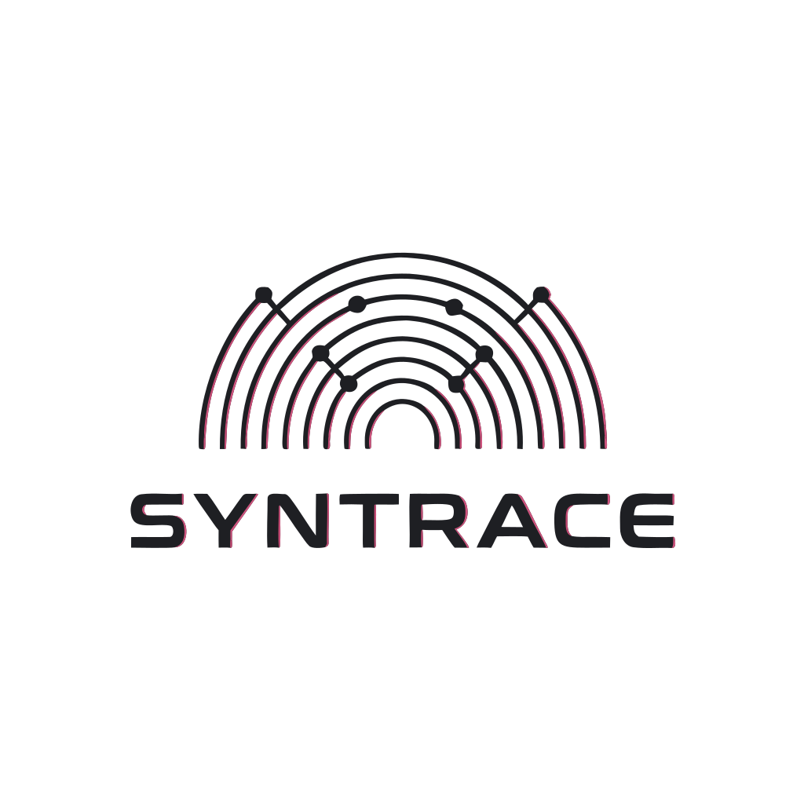
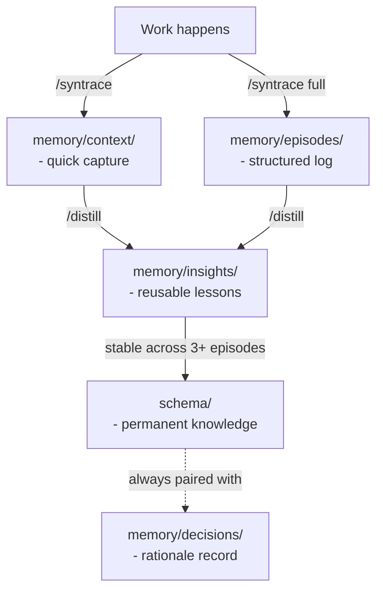

<p align="center">
  
</p>

<h1 align="center">Syntrace</h1>

<p align="center">
  <strong>Give your AI agents a memory that survives platform switches.<br/>Just folders and markdown. Works everywhere.</strong>
</p>

<p align="center">
  <a href="https://github.com/leksval/syntrace"></a>&nbsp;
  <a href="#license"></a>&nbsp;
  &nbsp;
  
</p>

<p align="center">
  <a href="#why">Why</a> · <a href="#how-it-works">How It Works</a> · <a href="#get-started">Get Started</a> · <a href="#whats-inside">What's Inside</a> · <a href="#knowledge-flow">Knowledge Flow</a>
</p>

---

## Why

Every time you switch AI tools - Cursor, Claude Code, Windsurf, your own agents - your context resets. Architecture decisions, patterns, lessons learned: all gone.

Syntrace fixes this. It stores project knowledge as plain files that any AI can read and write. **Switch tools, keep the memory.**

> No database. No API keys. No vendor lock-in. Copy a folder into your project and go.

---

## How It Works

Syntrace splits knowledge into two layers:

<table>
<tr>
<td width="50%" valign="top">

### Schema - the slow layer

What your project **is**. Changes rarely.

- Agent roles and responsibilities
- Architectural patterns and playbooks
- Quality policies and standards
- Tool definitions

</td>
<td width="50%" valign="top">

### Memory - the fast layer

What your project **learned**. Changes every session.

- Design decisions and their rationale
- Work logs and experiment results
- Distilled insights and reusable knowledge
- Quick captures and session notes

</td>
</tr>
</table>

Agents read both layers before they act. They write back when they're done. The knowledge stays with the project, not the platform.

---

## Get Started

**1. Copy into your project**

```bash
cp -r syntrace/ your-project/
```

**2. Tell your AI about it** (Cursor example - one time)

```bash
mkdir -p .cursor/rules
cp syntrace/cursor-rule.mdc .cursor/rules/syntrace.mdc
```

That's it. Your agent now has persistent memory. Three commands become available:

| Command | What happens |
|---------|-------------|
| `/syntrace` | Quick save - captures key points to `memory/context/` |
| `/syntrace full` | Full save - structured episode, decision record, changelog |
| `/distill` | Extract patterns - turns raw notes into reusable insights |

<details>
<summary><strong>What to customize first</strong></summary>

1. **Define your agents** - edit files in `schema/agents/` to match your workflow.
2. **Set your patterns** - add architectural patterns to `schema/patterns/`.
3. **Log a decision** - write your first design decision in `memory/decisions/`.

Each folder has a `_template.md` to get you started.

</details>

<details>
<summary><strong>Works with other platforms too</strong></summary>

Syntrace is just folders and markdown. Any AI that can read files can use it:

- **Claude Code** - point it at `AGENTS.md`
- **Windsurf** - add `AGENTS.md` as workspace context
- **Custom agents** - have them read `schema/` before acting, write to `memory/` after
- **Mobile tools** - edit markdown files from any device, sync via cloud storage

No platform-specific setup required beyond telling the agent where to look.

</details>

---

## What's Inside

```
syntrace/
│
├── AGENTS.md               Entry point for AI agents - reads this first
├── CHANGELOG.md             Project history, auto-appended by save protocol
├── llms.txt                 Machine-readable project summary
│
├── schema/                  🔒 STABLE - your project's structure
│   ├── agents/              Who does what (planner, worker, critic, librarian)
│   ├── patterns/            How things are built (playbooks, workflows)
│   ├── policies/            Quality standards and rules
│   ├── tools.md             Tool definitions and contracts
│   └── graph-schema.json    Node/edge types for knowledge graph queries
│
└── memory/                  🔄 EVOLVING - your project's experience
    ├── context/             Quick captures - default landing zone
    ├── decisions/           Why you chose X over Y (ADR-style)
    ├── episodes/            What happened - work logs, experiments, retros
    └── insights/            Reusable lessons extracted from episodes
```

**Schema** rarely changes - treat edits like architecture decisions (pair with a decision record).
**Memory** changes every session - agents write here freely.

Every subfolder includes a `_template.md` so you never start from a blank page.

---

## Knowledge Flow

Raw notes become insights. Stable insights become patterns. Nothing is lost.



---

## Key Features

| | Feature | Why it matters |
|---|---|---|
| **1** | **Platform-portable** | Folders and markdown. Works in Cursor, Claude Code, Windsurf, custom agents, mobile - anything that reads files. |
| **2** | **Zero dependencies** | No API, no database, no embeddings, no install. Copy and go. |
| **3** | **Knowledge extraction** | Raw session notes distill into insights, then promote into reusable patterns - automatically through the save protocol. |
| **4** | **Cloud-connected** | Link Google Drive, Figma, Notion, or any URL from file frontmatter. Agents with web access follow these links for richer context. |
| **5** | **Git-native** | Version your knowledge alongside your code. Diff decisions, branch experiments, merge insights. |
| **6** | **Tiered saves** | Quick capture for most sessions. Full structured save when it matters. Distillation when you want to extract patterns. |

---

## For AI Agents

> [!NOTE]
> If you are an AI agent, read [`AGENTS.md`](AGENTS.md) for full orientation: save protocol, frontmatter schemas, end-of-session checklist, and workspace conventions.

---

## Conventions

<details>
<summary>Naming, formatting, and file rules</summary>

- **Filenames** - `YYYY-MM-DD-slug.md`, lowercase, hyphens, no spaces.
- **File size** - keep `.md` files under ~300 lines. Split if longer.
- **Links** - relative markdown links between files.
- **Tags** - `tags: [...]` in YAML frontmatter for searchability.
- **Secrets** - never commit; use `.env` (gitignored).
- **Milestones** - `git tag v1.0.0`; no manual archiving.

</details>

---

## Contributing

Contributions, ideas, and alternative approaches are welcome.

1. Fork the repo
2. Create a branch: `git checkout -b my-feature`
3. Commit your changes: `git commit -m "add: my feature"`
4. Open a Pull Request

For structural changes to `schema/`, include a decision record in `memory/decisions/`.

---

<p align="center">
  If Syntrace is useful, <a href="https://github.com/leksval/syntrace">star the repo</a> - it helps others find it.
</p>

---

## License

This work is licensed under [Creative Commons Attribution 4.0 International (CC-BY 4.0)](https://creativecommons.org/licenses/by/4.0/).
