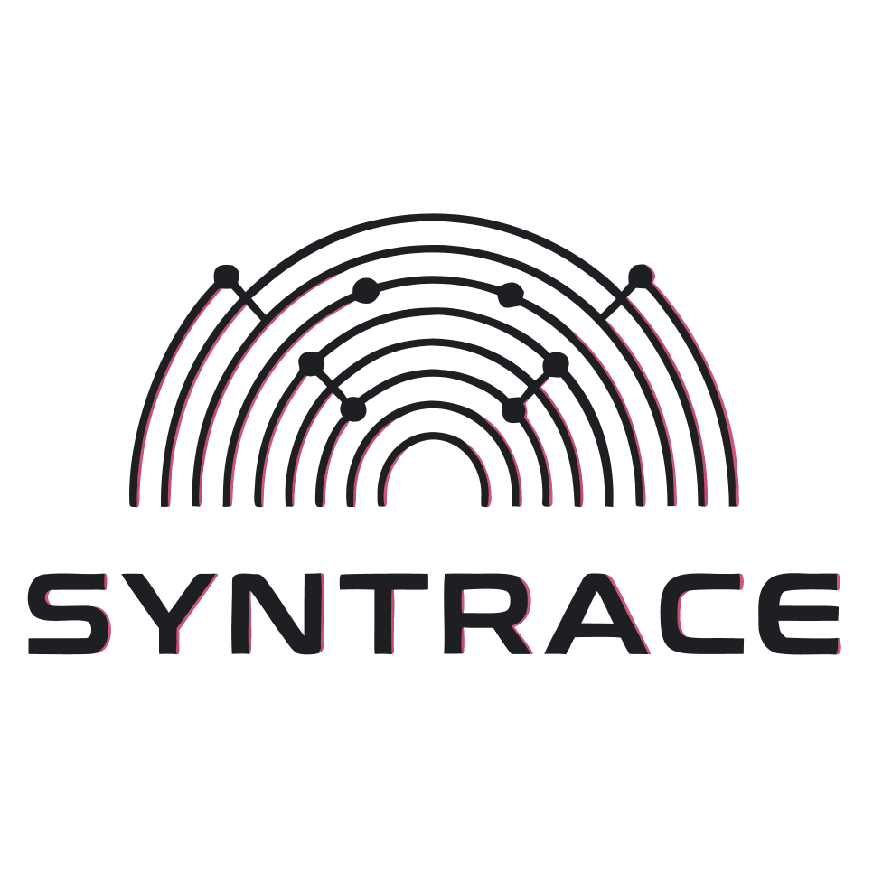

<p align="center">
  
</p>

<h1 align="center">Syntrace</h1>

<p align="center">
  <strong>One markdown file for project history, decisions, and reusable lessons.<br/>Portable. Local-first. No database. No API keys. Works with any LLM that can read text.</strong>
</p>

<p align="center">
  <a href="https://github.com/leksval/syntrace"></a>&nbsp;
  <a href="#license"></a>&nbsp;
  &nbsp;
  
</p>

<p align="center">
  <a href="#the-problem">The Problem</a> ·
  <a href="#the-idea">The Idea</a> ·
  <a href="#how-to-use">How To Use</a> ·
  <a href="#works-with">Works With</a> ·
  <a href="#get-started">Get Started</a>
</p>

---

## The problem

Project history gets lost more easily than it should. Decisions, debugging lessons, and hard-won patterns end up scattered across chats, commits, docs, and half-remembered conversations.

Syntrace fixes that by giving the project one durable, portable history file that can be read by humans and LLMs alike.

---

## The idea

Syntrace — **syn**aptic **trace** — is a single portable format that works like a **genome**:

- **Replication machinery** -- the cheat sheet and reference sections at the top and middle of the file. Constant. They tell the LLM how to read, write, and evolve the memory.
- **Accumulated knowledge** -- the history sections at the end of the file. They grow every session. Episodes, decisions, insights, context -- each entry linked to its ancestors through lineage fields, like genes carrying their evolutionary history.
- **Phenotype snapshot** -- the Memory Index inside the history block. Auto-generated each save. Shows what's active, what's high-confidence, and what's unresolved right now.

One file. One command. Copy it anywhere and it carries everything forward.

---

## Who it's for

Developers who use AI coding assistants and want:

- **Memory that survives across sessions** without re-explaining your project every time
- **One source of truth** for project history instead of scattered notes and chat preambles
- **Portable knowledge** that moves with your repo, not locked to one vendor
- **Traceable decisions** with lineage and evidence, not scattered notes

If you use any LLM for coding -- in a chat window or in an IDE -- Syntrace works.

---

## How the file is laid out

[`syntrace.md`](syntrace.md) is three layers in one file:

| Layer | What it is | Who reads it |
|-------|------------|--------------|
| **Top -- cheat sheet** | Compact operating rules for saving and updating the file. | You and the LLM before each save. |
| **Middle -- reference + examples** | Full specification: save protocol, entry formats, lineage rules, tag canon, architecture, scaling, plus examples. | The LLM when saving; you when learning or customizing. |
| **Bottom -- history** | Memory Index + Context / Episodes / Decisions / Insights / Changelog. This is the append-only project history. | You, every session. The LLM appends here. |

You do **not** need to read the whole file to start. Paste the file, work, say `/syntrace`.

---

## How to use

### No install (paste and go)

1. Copy [`syntrace.md`](syntrace.md) into your project
2. Paste its contents into any LLM -- ChatGPT, Claude, Cursor, Claude Code, Windsurf, anything that reads text
3. Work normally
4. Say `/syntrace` when done -- the LLM outputs the **complete** file with your session appended (Episode + Decision if applicable + Insight if a pattern emerged + Context if a standalone observation + Changelog line + refreshed Memory Index)
5. Save it, replacing the old version
6. Next session, paste it again. The LLM picks up where you left off.

The LLM may ask 1-2 brief clarification questions before saving if the session scope or a key decision is ambiguous.

---

## Generate lessons from Syntrace

You can also use `syntrace.md` as a **read-only memory source** to ask Cursor for reusable lessons from prior LLM-assisted work. The agent should synthesize from the current project chat, actual code or doc changes, and the durable memory already stored in Syntrace.
When you want to save the result, the agent should return an **append-only markdown block** to place at the end of your destination file rather than rewriting the whole file.

Best markdown-only workflow:

- Prefer the local `syntrace.md` in the current workspace
- Fall back to a raw GitHub markdown URL when you want to reuse memory across repos
- If neither is accessible, paste the markdown contents into chat
- Run this after each chat, or at most every couple of sessions, so the source stays distilled and does not bloat the next prompt's context window

Use this prompt in Cursor:

```md
Extract the highest-signal reusable knowledge from this project's chat history and actual changes, using Syntrace as the durable memory source.

Source priority:
1. If `syntrace.md` exists in the current workspace, read that file first.
2. Otherwise read this raw markdown URL: <RAW_GITHUB_URL>
3. If you cannot access either source, ask me to paste the markdown contents.

Instructions:
- Use the current project chat and the actual changes made in this session as the primary source of new learning.
- Read the full Syntrace file, but focus especially on `Insights`, `Decisions`, `Episodes`, `Context`, and `Memory Index`.
- Extract reusable lessons learned from prior LLM-assisted work and development sessions.
- Connect what changed in this session with relevant prior patterns already stored in Syntrace.
- Deduplicate overlapping ideas.
- Merge repeated evidence into one stronger lesson instead of listing variants.
- Prefer high-confidence insights and accepted decisions.
- Use episodes and context entries as supporting evidence when they reinforce a lesson.
- Use an elegant six-section structure: `Goal`, `Context`, `Decisions`, `Evidence`, `Lessons`, `Next Changes`.
- In `Lessons`, call out patterns and anti-patterns explicitly.
- Ignore filler, one-off narration, and anything not useful for future work.
- Treat Syntrace as a read-only source file.
- Do not rewrite the source file or regenerate the entire destination file.
- Return only an append-only markdown block intended to be added at the end.
- Output only markdown.

Return format:

# Lessons From Syntrace

## Goal
What this work was trying to achieve, why it mattered, and what success looked like.

## Context
Constraints, assumptions, dependencies, stakeholders, and background that shaped the work.

## Decisions
The most important choices, tradeoffs, and rejected alternatives that matter for future work.

## Evidence
What actually happened in practice: key events, signals, metrics, impact, and concrete observations.

## Lessons
The distilled reusable knowledge: patterns, anti-patterns, stable lessons, tentative insights, and open questions.

## Next Changes
Action items, experiments, reusable rules, and revisit triggers.
```

This works well because Syntrace already separates durable patterns from raw session history: `Insights` hold distilled lessons, `Decisions` capture durable rationale, and `Episodes` / `Context` supply evidence. The agent should combine that durable memory with the current project chat and actual session changes, then return only the block to append. Ideally run this after each chat, or every few chats at most, so the memory stays compact and future prompts do not get bloated by long unresolved session history.

---

## What it captures

Every `/syntrace` evaluates the full session and writes what's appropriate:

| Section | What goes here |
|---------|---------------|
| **Memory Index** | Auto-generated snapshot: active decisions, high-confidence insights, open questions |
| **Context** | Quick observations, gotchas, things worth remembering |
| **Episodes** | Structured work logs with outcomes and takeaways |
| **Decisions** | Architecture choices with rationale, alternatives, and consequences |
| **Insights** | Distilled reusable patterns with confidence levels and evidence trails |
| **Changelog** | One-line session summaries |

Entries carry **lineage metadata** -- `derived_from`, `evidence`, `supersedes`, `superseded_by` -- so knowledge evolution is traceable. Each entry's heading slug is its stable identifier, used for all cross-references.

---

## Works with

Syntrace is the canonical format. Import from and export to tool-native formats:

| Tool | Import | Export | Notes |
|------|--------|--------|-------|
| **Claude Code** (`CLAUDE.md`) | yes | yes | Each `##` section maps to a Syntrace entry |
| **Cursor** (`.cursor/rules/`) | yes | yes | Each `.mdc` file maps to a Syntrace entry |
| **Plain LLM chat** | -- | -- | Paste the file directly, no adapter needed |
| **Any markdown tool** | yes | yes | The file is standard markdown |

See the interoperability section in [`syntrace.md`](syntrace.md) for the field-by-field translation rules.

---

## Two modes

**Paste mode** -- copy the file into a plain LLM chat (ChatGPT, Claude). Paste any relevant project files alongside it. Work. Save the output.

**Workspace mode** -- use inside an IDE agent (Cursor, Claude Code, Windsurf). The agent reads neighboring files automatically and writes richer, more connected entries.

Same file, same spec. Works both ways.

---

## Example

After three sessions, the memory half of your file might look like:

```
## Insights

### 2026-01-15-exponential-backoff-with-jitter
- **type**: howto
- **confidence**: medium
- **episode_count**: 2
- **tags**: api, error-handling, performance
- **derived_from**: 2026-01-15-fix-payment-timeout
- **evidence**: 2026-01-15-fix-payment-timeout, 2026-01-10-auth-token-expiry-gotcha
- **updated**: 2026-01-20

#### Summary
When calling external APIs that intermittently timeout, use exponential
backoff (base 500ms, max 8s) with +/-10% jitter. Fixed-interval retries
cause thundering herd on recovery.

#### When to apply
When you see timeout or rate-limit errors on outbound HTTP calls,
especially during peak traffic. NOT for 4xx auth errors -- those
should fail fast.
```

The reference at the end of `syntrace.md` told the LLM how to write this. You just said `/syntrace`.

---

## Get started

Copy the file:

```bash
cp syntrace.md your-project/syntrace.md
```

Optional: delete the **EXAMPLES** block at the bottom of `syntrace.md` for a clean slate -- the **REFERENCE** block stays; it is the replication machinery.

One file. One command. Paste and go.

---

## License

[CC-BY 4.0](https://creativecommons.org/licenses/by/4.0/) -- use it, remix it, share it. Just give credit.
