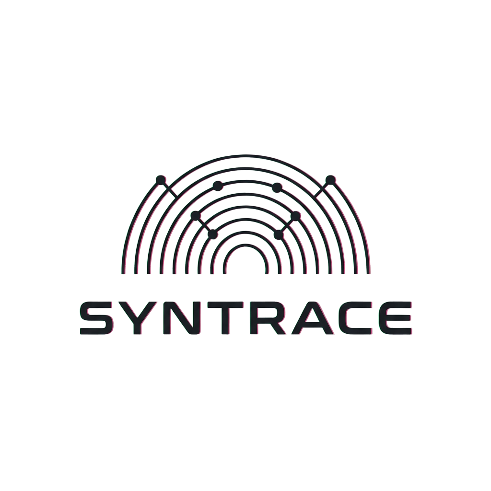
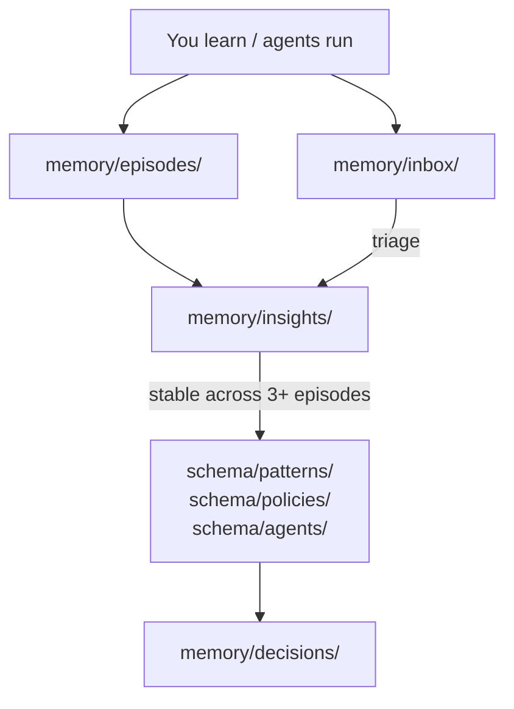

<p align="center">
  
</p>

<h1 align="center">Syntrace</h1>

<p align="center">
  <strong>Dual-inheritance knowledge architecture for AI-assisted projects.</strong>
</p>

<p align="center">
  <a href="LICENSE"></a>
  
  
</p>

<p align="center">
  <a href="#quick-start">Quick Start</a> ·
  <a href="#features">Features</a> ·
  <a href="#folder-map">Folder Map</a> ·
  <a href="#how-knowledge-flows">How It Works</a> ·
  <a href="AGENTS.md">Agent Docs</a>
</p>

---

## What is Syntrace?

Syntrace is a filesystem-native project template that separates knowledge into two layers
-- **schema** (stable structure) and **memory** (evolving experience) --
so that humans and AI agents share a single source of truth.
Folders and markdown only. Clone it for every new project.

> [!TIP]
> Syntrace is a **template**, not a dependency. Copy the folder, initialize git, and start building. No install step, no lock-in, any stack.

---

## Features

| Feature | Description |
|---|---|
| **Dual-layer architecture** | Schema (roles, policies, patterns) changes rarely; Memory (decisions, episodes, insights) evolves continuously |
| **AI-agent ready** | `AGENTS.md` gives any LLM full workspace orientation, save protocol, and end-of-session checklist |
| **Zero dependencies** | Plain markdown and folders -- works with any language, framework, or toolchain |
| **Built-in knowledge flow** | Episodes distill into insights; stable insights promote to schema; every schema change gets a decision record |
| **Template-based consistency** | `_template.md` files in each folder enforce frontmatter schemas and structure |
| **Git-native milestones** | Use `git tag` for releases -- no archive folders or manual versioning |

---

## Quick Start

```bash
cp -r syntrace/ my-new-project/
cd my-new-project/
git init && git add . && git commit -m "init: project scaffold from syntrace template"
```

<details>
<summary><strong>Next steps after scaffolding</strong></summary>

1. Edit `schema/agents/*.md` to define your agent roles.
2. Edit `schema/patterns/*.md` to define your architecture.
3. Log your first design decision in `memory/decisions/`.
4. Start coding in `src/`.

</details>

---

## Folder Map

```
.
├── README.md                     <- You are here
├── CHANGELOG.md                  <- Human-readable project history
├── AGENTS.md                     <- AI agent orientation
├── llms.txt                      <- Machine-readable project summary
│
├── schema/                       <- Slow-changing, structural knowledge
│   ├── agents/                   <- One .md per agent role
│   ├── patterns/                 <- Architectural patterns and playbooks
│   ├── policies/                 <- Standing rules and quality standards
│   └── tools.md                  <- Tool definitions and contracts
│
├── memory/                       <- Fast-changing, experiential knowledge
│   ├── decisions/                <- ADR-style design decisions
│   ├── episodes/                 <- Work logs, experiment results, retrospectives
│   ├── insights/                 <- Distilled reusable knowledge
│   └── inbox/                    <- Unsorted captures, to be processed
│
├── src/                          <- Source code
├── tests/                        <- Tests
└── docs/                         <- Technical documentation
```

---

## How Knowledge Flows



---

## For AI Agents

> [!NOTE]
> If you are an AI agent, read [`AGENTS.md`](AGENTS.md) for full workspace orientation, save protocol, frontmatter schemas, and end-of-session checklist.

---

## Conventions

- **Dates** -- always `YYYY-MM-DD` prefix in filenames.
- **Slugs** -- lowercase, hyphens, no spaces.
- **File size** -- keep individual `.md` files under ~300 lines. Split if longer.
- **Links** -- use relative markdown links between files.
- **Tags** -- add `tags: [tag1, tag2]` in frontmatter for searchability.
- **Milestones** -- use `git tag v1.0.0` to mark releases; no manual archiving.
- **No secrets** -- never commit API keys or tokens; use `.env` (gitignored).

---

## Contributing

Contributions are welcome. To get started:

1. Fork the repository.
2. Create a feature branch: `git checkout -b my-feature`.
3. Make your changes and commit: `git commit -m "add: my feature"`.
4. Push to your fork: `git push origin my-feature`.
5. Open a Pull Request.

Please follow the conventions above and include a decision record in `memory/decisions/` for any structural changes to `schema/`.

---

## License

MIT. See [LICENSE](LICENSE) for details.
