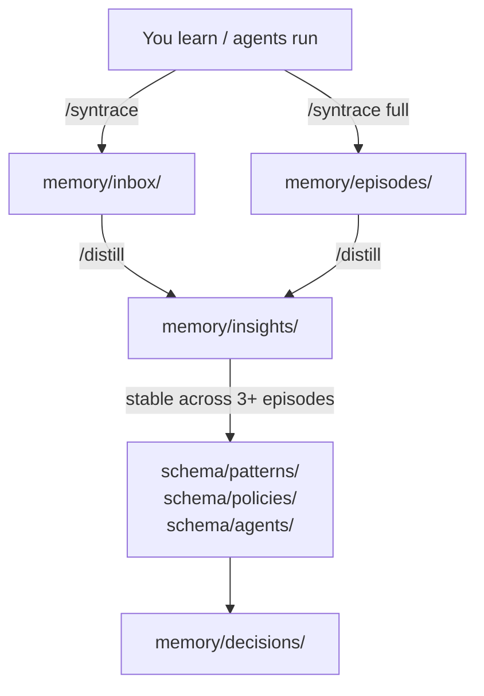

<p align="center">
  
</p>

<h1 align="center">Syntrace</h1>

<p align="center">
  <strong>Persistent, portable knowledge for agentic AI. Any platform. Any agent. Just folders and markdown.</strong>
</p>

<p align="center">
  <a href="https://github.com/user/syntrace/stargazers"></a>
  <a href="#license"></a>
  
  
</p>

<p align="center">
  <a href="#quick-start">Quick Start</a> ·
  <a href="#features">Features</a> ·
  <a href="#folder-map">Folder Map</a> ·
  <a href="#how-knowledge-flows">How It Works</a> ·
  <a href="AGENTS.md">Agent Docs</a>
</p>

---

## The Problem

You switch between Cursor, Claude Code, Perplexity, your own agents, mobile tools. Every switch is a factory reset. The patterns your agent found, the decisions it made, the architecture it finally understood: gone.

Vector databases lock you to one provider's embeddings. Custom instructions don't transfer. Platform-specific memory features disappear the moment you leave that platform.

**Memory should be a property of the project, not the platform.**

## What is Syntrace?

Syntrace makes project knowledge persistent and portable across any agentic AI platform. It's just folders and markdown, the one format every agent already knows how to read and write.

Two layers:
- **Schema** (stable structure): agent roles, patterns, policies. Changes rarely.
- **Memory** (evolving experience): decisions, work logs, insights. Changes every session.

Agents read both before they act. They write to both when they're done. Switch platforms, switch models, switch everything. The knowledge stays with the project.

Because it's just files, the whole workflow lives wherever your files live. Store it in Google Drive, Dropbox, OneDrive, iCloud, or any cloud storage. Edit it from any device. Fork it for a new project. Share it with a team. No sync service, no proprietary format, no walled garden.

> [!TIP]
> Syntrace is a **template**, not a dependency. Copy the folder into any project and start. No install, no API keys, no database. Works with any stack, any platform, any agent, any cloud storage.

---

## Features

| Feature | Description |
|---|---|
| **Platform-portable** | Folders and markdown. Works in Cursor, Claude Code, Perplexity, custom agents, mobile tools, anything. |
| **Dual-layer architecture** | Schema (stable structure) changes rarely; Memory (evolving experience) changes every session |
| **Knowledge extraction** | Raw captures distill into insights; stable insights promote into reusable patterns across projects |
| **Cloud-connected** | Link to Google Drive, Figma, Notion, Dropbox, or any URL from frontmatter. Agents with web search or browsing capabilities can follow these links to pull in external context. |
| **Tiered save protocol** | `/syntrace` for quick capture, `/syntrace full` for structured saves, `/distill` to extract knowledge |
| **Zero dependencies** | No API, no database, no embeddings. Copy a folder and go. Any stack. |
| **Git-native** | Version your knowledge alongside your code. Diff it, branch it, merge it. |

---

## Quick Start

**New project from template:**

```bash
cp -r syntrace/ my-new-project/syntrace/
cd my-new-project/
git init
```

**Enable AI memory trigger** (one-time):

```bash
mkdir -p .cursor/rules
cp syntrace/cursor-rule.mdc .cursor/rules/syntrace.mdc
```

Three commands are now available:

| Command | What it does |
|---------|-------------|
| `/syntrace` or `update memory` | Quick save to `memory/inbox/` |
| `/syntrace full` | Full save: episode + decision + CHANGELOG |
| `/distill` | Librarian run: inbox/episodes → insights → schema proposals |

<details>
<summary><strong>Next steps after scaffolding</strong></summary>

1. Edit `syntrace/schema/agents/*.md` to define your agent roles.
2. Edit `syntrace/schema/patterns/*.md` to define your architecture.
3. Log your first design decision in `syntrace/memory/decisions/`.
4. Start coding in `src/`.

</details>

---

## Folder Map

```
.
├── README.md                     <- You are here
├── CHANGELOG.md                  <- Human-readable project history
├── AGENTS.md                     <- AI agent orientation
├── llms.txt                      <- Machine-readable project summary
│
├── schema/                       <- Slow-changing, structural knowledge
│   ├── agents/                   <- One .md per agent role
│   ├── patterns/                 <- Architectural patterns and playbooks
│   ├── policies/                 <- Standing rules and quality standards
│   └── tools.md                  <- Tool definitions and contracts
│
├── memory/                       <- Fast-changing, experiential knowledge
│   ├── decisions/                <- ADR-style design decisions
│   ├── episodes/                 <- Work logs, experiment results, retrospectives
│   ├── insights/                 <- Distilled reusable knowledge
│   └── inbox/                    <- Unsorted captures, to be processed
│
├── src/                          <- Source code
├── tests/                        <- Tests
└── docs/                         <- Technical documentation
```

---

## How Knowledge Flows



---

## For AI Agents

> [!NOTE]
> If you are an AI agent, read [`AGENTS.md`](AGENTS.md) for full workspace orientation, save protocol, frontmatter schemas, and end-of-session checklist.

---

## Conventions

- **Dates** -- always `YYYY-MM-DD` prefix in filenames.
- **Slugs** -- lowercase, hyphens, no spaces.
- **File size** -- keep individual `.md` files under ~300 lines. Split if longer.
- **Links** -- use relative markdown links between files.
- **Tags** -- add `tags: [tag1, tag2]` in frontmatter for searchability.
- **Milestones** -- use `git tag v1.0.0` to mark releases; no manual archiving.
- **No secrets** -- never commit API keys or tokens; use `.env` (gitignored).

---

## Support the Project

If Syntrace is useful to you, star the repo. It helps others discover it and tells me this direction is worth pushing further.

[](https://github.com/user/syntrace)

---

## Contributing

Contributions, ideas, and alternative approaches are all welcome. To get started:

1. Fork the repository.
2. Create a feature branch: `git checkout -b my-feature`.
3. Make your changes and commit: `git commit -m "add: my feature"`.
4. Push to your fork: `git push origin my-feature`.
5. Open a Pull Request.

Please follow the conventions above and include a decision record in `memory/decisions/` for any structural changes to `schema/`.

---

## License

This work is licensed under [Creative Commons Attribution 4.0 International (CC-BY 4.0)](https://creativecommons.org/licenses/by/4.0/).
